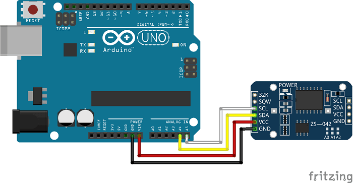

# Gestion d'une horloge temps réel DS3231 avec Arduino #

[https://www.maximintegrated.com/en/products/digital/real-time-clocks/DS3231.html](https://www.maximintegrated.com/en/products/digital/real-time-clocks/DS3231.html "https://www.maximintegrated.com/en/products/digital/real-time-clocks/DS3231.html")

[https://learn.adafruit.com/adafruit-ds3231-precision-rtc-breakout/arduino-usage](https://learn.adafruit.com/adafruit-ds3231-precision-rtc-breakout/arduino-usage "https://learn.adafruit.com/adafruit-ds3231-precision-rtc-breakout/arduino-usage")

Le but du programme est de fournir une solution pour configurer la RTC DS3231 en utilisant un protocole série par lequel on fournit la date et l'heure soit en utilisant un timestamp, soit en utilisant une chaine de caractère YYMMDDHHmmSS.

Dans les deux cas, la transmission se termine par un retour à la ligne '\n'

## Remarque  : ##

### le timestamp c'est quoi ? ###
Le timestamp (unix) désigne le nombre de secondes écoulées depuis le 1er janvier 1970 à minuit UTC précise. Les avantages sont multiples :

- facilite la comparaison de date, puisque ça reviens à faire une differente entre 2 nombres
- gérer par la plupars des langage et SGBD
- universel, puisque pas de notion de fuseaux horaire

quelques inconvenients :

- le nombre en lui même n'est pas parlant pour un humain, obligé de passer par un convertisseur
- ne gère pas (nativement) avant 1970, donc pour gerer les dates de naissances par exemple, ce n'est pas l'idéal

[http://www.timestamp.fr/](http://www.timestamp.fr/ "http://www.timestamp.fr/")

## Usage : ##

Suivant le mode de configuration choisi, commenter ou décommenter les directives :

Configuration par chaine DATETIME : 

    //#define TIMESTAMP
    #define DATETIME

Configuration par un timestamp : 

    #define TIMESTAMP
    //#define DATETIME

## Sortie :  ##
Le rpogramme sort sur le port série une chaine contenant le timestamp et la date et l'heure toutes les secondes :

    1529614174 = 21/6/2018 22:49:34